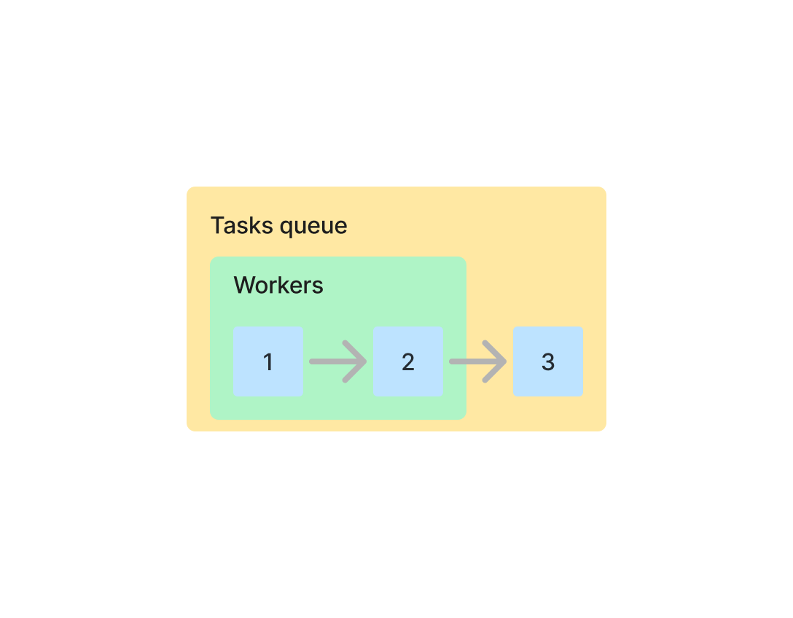
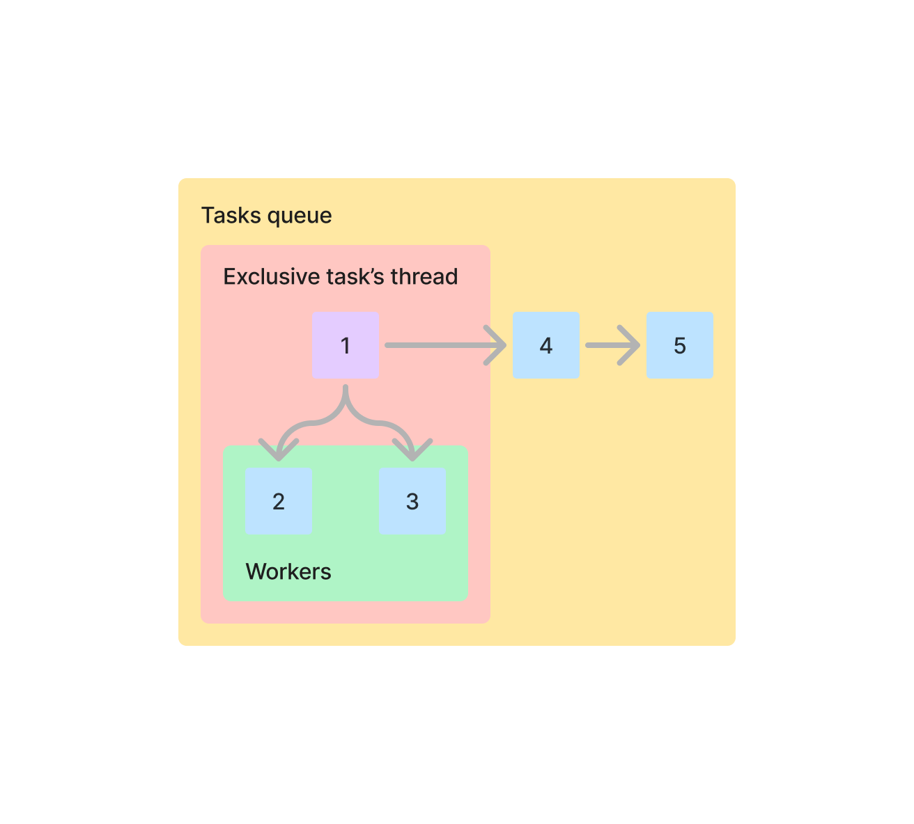
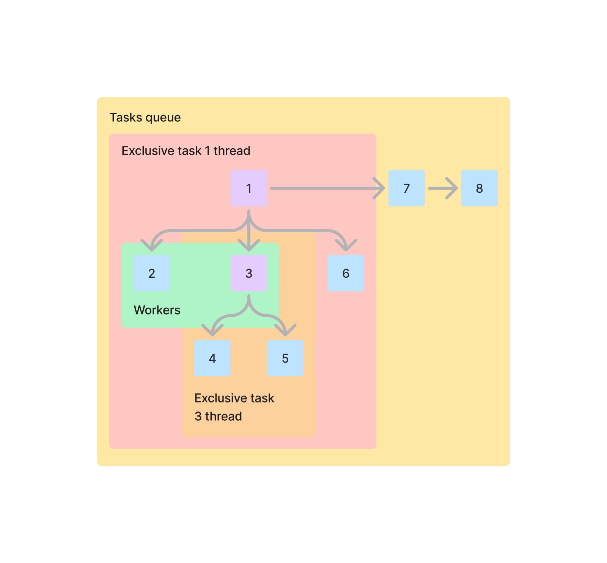

# Miyabi Scheduler

`miyabi_scheduler` is a specific threads scheduling library for rust where
you expect to have two main types of tasks: "thin" and "thick"
(internally called "normal" and "exclusive" / "locking"). This scheduler
allows you to gain "exclusive lock" for one specific task and all the tasks
which will be spawned by it.

Normally tasks queue looks like this:

Scheduler uses 2 workers to process them one by another, with all 3 sitting
in the buffer. However, sometimes you want to spawn new tasks while processing
the current ones! And sometimes you want these new tasks to use data owned
by its ancestor task and drop it later to not to waste user's RAM. That's what
I call an "exclusive lock" or "exclusive task": you let scheduler know that
you really want to process this one specific task using all the available
powers, and only then switch to the other tasks. That's how it looks like:

Scheduler will spawn a new thread for this one exclusive task to process it there,
and use all available workers to process all the new tasks which will be spawned
by the exclusive one. New thread is needed to ensure that exclusive tasks
will not be bounded by the amount of available workers. Otherwise, say
your scheduler has only 1 worker and you have 2 exclusive tasks: you would
have a little problem processing such a queue. Thus new thread is a necessary evil.

It's important to note that the scheduler will not be unlocked until
the exclusive task's *context* (special struct to spawn new tasks)
is dropped. So if you move it in another thread and forget to drop
at some point - you must count on your own! Make a copy of the scheduler's
original context struct if you want to spawn new tasks in it.

Sometimes your exclusive tasks can be nested. This is also handled properly
by this library, by making a recursive lock (so you can't repeat the proces
infinitely, but I really didn't want to implement some loop logic for this).
That's how it would look like:

Task 1 will spawn 2, 3, and 6. Then, while processing 2, we will lock
scheduler *again* and process 4 and 5. Then, once 3's context is dropped,
unlock second lock and continue processing 6. Then unlock 2's lock and
continue processing 7 and 8.

*Named after [Hoshimi Miyabi](https://zenless-zone-zero.fandom.com/wiki/Hoshimi_Miyabi) from Zenless Zone Zero 🙏*

*Image was taken from [here](https://www.pinterest.com/pin/350858627237946126)*

Author: [Nikita Podvirnyi](https://github.com/krypt0nn)\
Licensed under [MIT](LICENSE)
